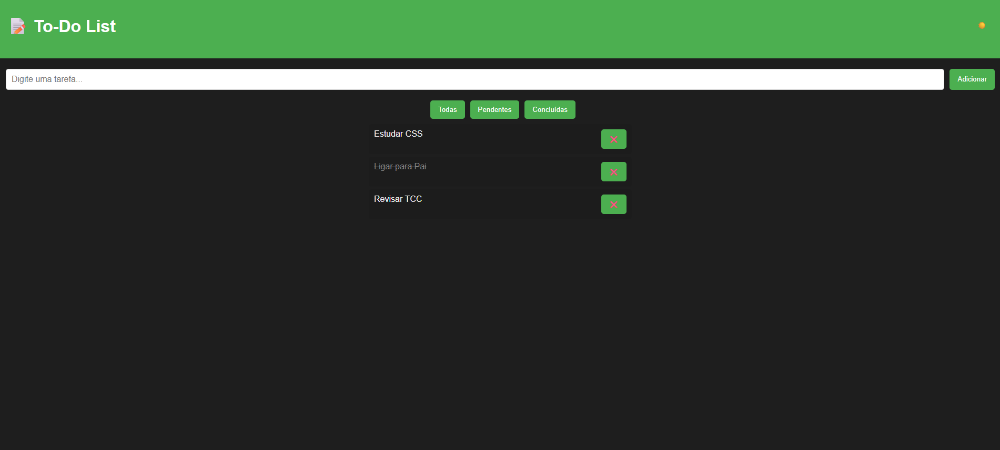

# 📝 To-Do List Moderna

Uma aplicação simples e moderna para gerenciar suas tarefas, feita com **HTML + CSS + JavaScript**.

## ✨ Funcionalidades
- Adicionar, marcar como concluída e remover tarefas
- Filtros: todas, pendentes e concluídas
- Tema claro/escuro
- Salva automaticamente no **localStorage**

## 🚀 Tecnologias
- HTML5
- CSS3
- JavaScript (DOM, Eventos, localStorage)

## 📸 Preview

## 📦 Como usar
1. Baixe ou clone este repositório
2. Abra o `index.html` no navegador

